# Powering up your Power BI Report deployments with Azure DevOps and Powershell!   

This article is the follow-up to our [Deploying Power BI reports using Azure Devops](https://github.com/becheng/pbi-azuredevops-poc) proof of concept (PoC).  To quickly recap, our first PoC focussed on the developing an Azure DevOps CI/CD pipeline to  deploy a Power BI report using the PowerBI Actions add-in - *easy peasy!*  This time around, we take it up a notch and do everything in Powershell and address several areas where the first PoC fell short along with some added instructions to *power up* your pipeline.     

## Goals this time around...
- **Use of the Service Principal** instead of administrator user account to access and manage the Power BI tenant.  Using a Service Principal (SP) is best practice and saves on using account with a PowerBI pro license.
- Use of  PowerBI Gateways - specifically the **re-binding the PowerBI dataset to a gateway** after every release.  A gateway is needed if your datasources sit on on-prem so the PowerBI report (in the cloud) knows how to connect to it.  A gateway is not needed for cloud datasources, so we provide an alterative Powershell script to use.  
- **Automating the dataset's refresh schedule** as part of the devops pipeline.
- **Installing a local gateway under a Service Principal account** (in Public Preview).
- **Adding a user account (with Power BI pro account) to the workspace**.  While using a SP is the preferred approach, at the time of writing this, the binding of the gateway to a Power BI dataset only works with a user level account.  That being said, you can't sign into the Power BI portal using a SP, so adding a user account to the workspace comes in handy to eyeball the changes.        
   
### 1.0 Creating the Serivce Principal (SP)
We defer to the offical [msdoc](https://docs.microsoft.com/en-us/power-bi/developer/embedded/embed-service-principal#get-started-with-a-service-principal) to setup up the SP.  At a high level the steps involved include, i. creating an Azure AD app registration with a secret, ii. assigning the app with Power BI API permissions, iii. creating a new Azure AD security group and adding the app/SP as a member, and finally iv. assigning that security group with access to both the PowerBI APIs and the ability to create new workspaces within the PowerBI Service tenant. 

1. Follow this [msdoc](https://docs.microsoft.com/en-us/power-bi/developer/embedded/embed-service-principal#get-started-with-a-service-principal) to set up a SP with access to the PowerBI Apis.  Skip steps 4 & 5 because we do these dynanically via the script. 
2. In your Azure portal, select the Azure AD app, go to its *API permissions*, click *Add a permission*, select *Power BI Service* and add the *Delegated* permissions of `Dataset.ReadWrite.All` and `Workspace.ReadWrite.All`.
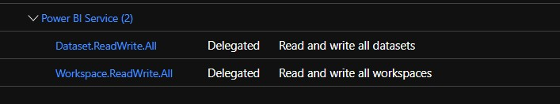
4. Sign in to your Power BI portal with an admin account, goto *Settings* (Gear Icon) > *Admin Portal* > *Tenant settings*.
5. Under *Developer settings*, go to *Allow service principals to use PowerBI APIs*, enable it and add the security group.
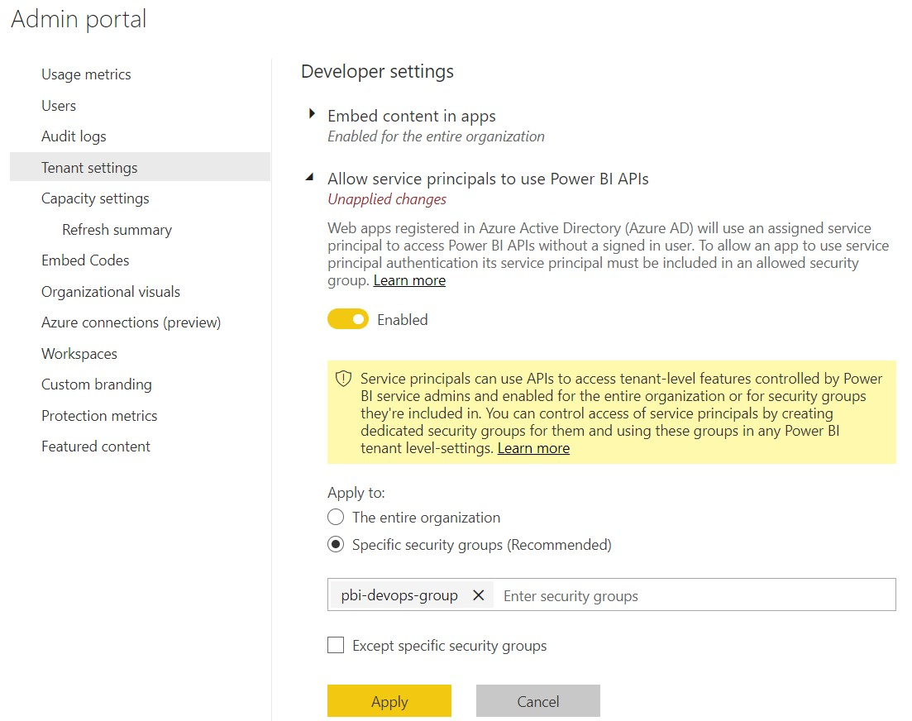  
6. Under *Workspace settings*, go to *Create workspaces*, enable it and add the security group.
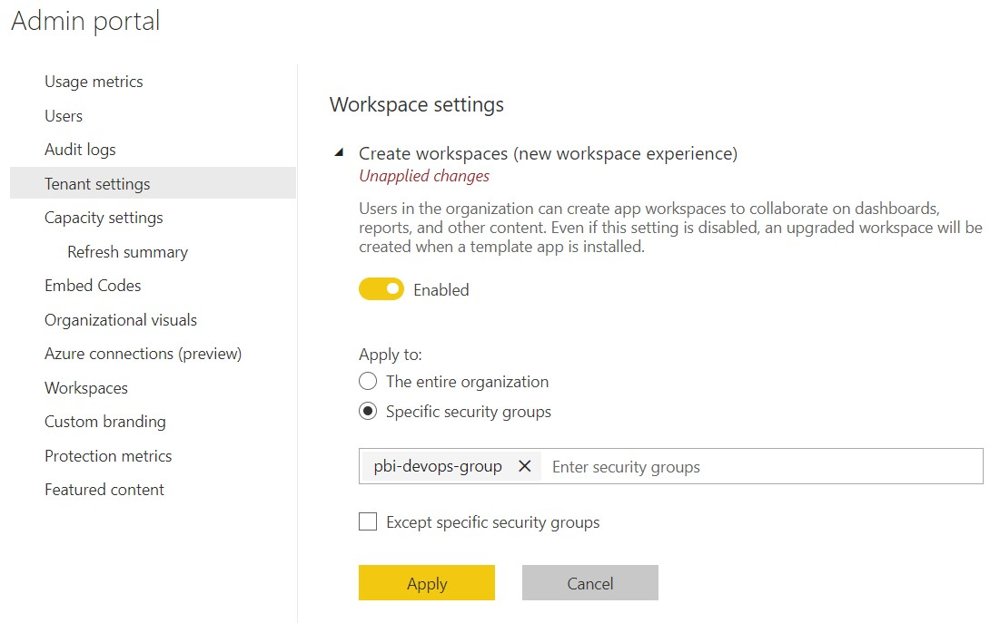

### 2.0 Installing the Power BI Gateway
We use a nifty Powershell script to provision the gateway under a service principal account.  Again this feature is under Preview at the time of this writing so if you prefer to use a user account instead, follow this [msdoc](https://docs.microsoft.com/en-us/data-integration/gateway/service-gateway-install).

1. Download the [gateway.ps1](./ps-scripts/gateway.ps1) script to the local machine where your on-prem datasource resides. 
2. Update the script variables including the app client Id, tenant Id, secret and the email of user with PowerBI pro license.  
3. Run the script, e.g. `./gateway.ps1` and check your Task Manager to see the gateway is running. 
  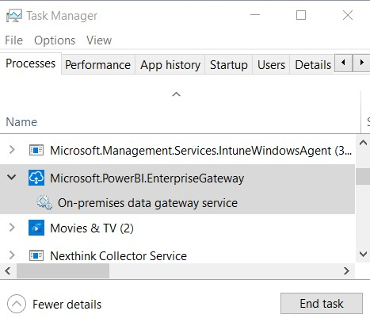 
4. Sign in to Power BI portal with Power BI Pro user, go to *Settings*, *Manage Gateways* and see your named gateway is listed under *Gateway Clusters*.
  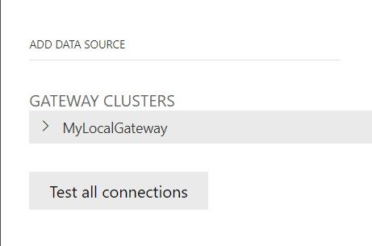 
5. Select the gateway and click *Add Data Source* (located at the top).
6. Name the datasource, e.g. *my-gateway-datasource* and specify the connection values to the local datasource.  In our case, we used a local Sql Server instance, enabled SQL authenication, and connected with a service level db username and password.
  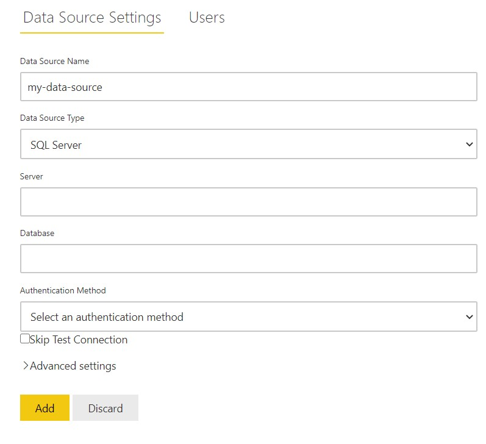   
7. Make a note of the gateway and its datasource names as they will be used later to setup the devops pipeline.

### 3.0 Parameterizing the PowerBI Report datasource
For context, our deployment Powershell scripts relys on the best practice of parameterized data sources in Power BI reports. If your reports already do this, *Awesome!*, just move on to the next section.

1. Using your Power BI Desktop editor, open your report, expand *Transform data* and select *Data source settings*.
   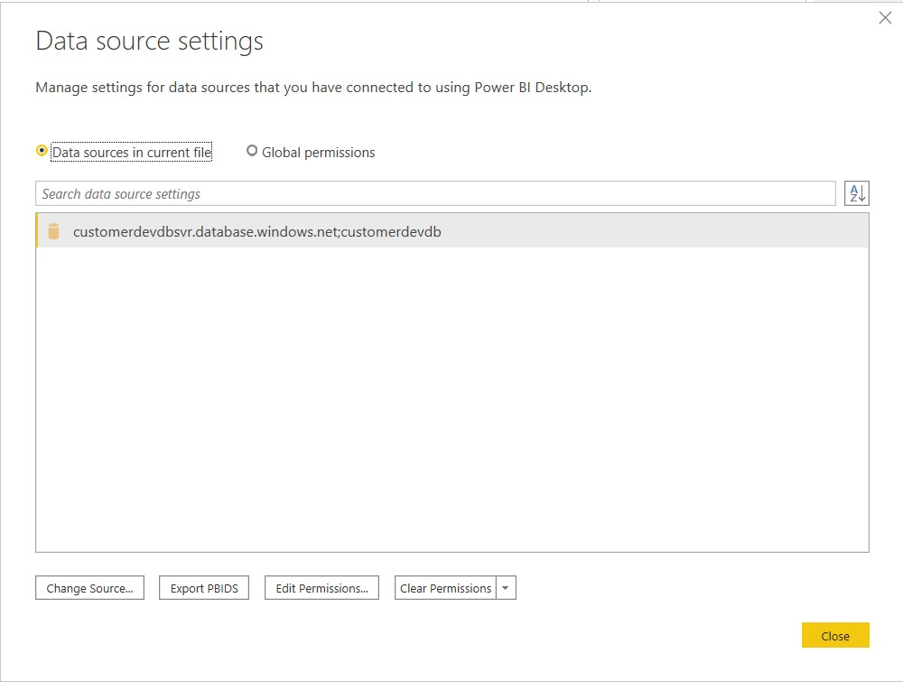 
2. Select the *Change Source...* button to open your respected data source (in our case, it was Sql Server) window.
3. Select the *Server* dropdown and select *New Parameter...*  
   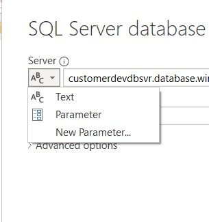
4. In the *Manage Parameters* window: 
   - Add new parameter for the database server, e.g. `dbServerParam`.
   - Check the Required checkbox to make the parameter mandatory
   - Enter your default server (typically your development instance) in the *Current Value* field.     
  
5. Repeat the above step and add new parameter for the database name, e.g. `dbServerName`.
6. Make note of both parameter names because they will be used later to set up the pipeline.

### 4.0 A "break down" of the Powershell script
Before we get into creating the devops pipelines, we do a break down what the powershell scripts are doing.
**@TODO**

### 5.0 Putting it all together in Azure DevOps
We use [Azure Devops](https://dev.azure.com/) to build our build and release pipelines to deploy the Power BI reports to the Power BI portal.  We start by creating a Devops project and checking in your report (.pbix) and deployment powershell scripts to the project repo.

1. Sign into your [Azure Devops](https://dev.azure.com) instance and create a new project, e.g. `my-pbidevops-pipeline`.
2. Add your .pbix files to the project's repo.
3. Download a copy of the [deploy-report-with-gateway.ps1](./ps-scripts/deploy-pbixreport-with-gateway.ps1) or [deploy-pbixreport.ps1](./ps-scripts/deploy-pbixreport.ps1) (if using cloud datasources) and upload it to your project's repo.
  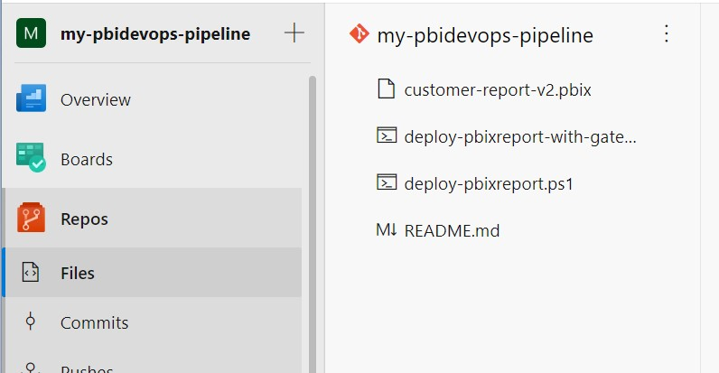

#### 5.1 Create a Pipeline
We construct a simple build pipeline that publishes our files for deployment.

1. Create a new *Pipeline*, e.g. `my-pbidevops-build`.
2. Copy the following yaml script and save it to the pipeline.  This script publishes the .pbix and .ps1 files so the (deployment) *Release* pipeline has access to them.
      
    ```
    trigger:
    - master

    pool:
      vmImage: 'ubuntu-latest'

    steps:
    - task: CopyFiles@2
      displayName: 'Copy Files to: Staging Artifact'
      inputs:
        Contents: |
          *.pbix 
          *.ps1
        TargetFolder: '$(Build.ArtifactStagingDirectory)'
        OverWrite: true
    - task: PublishBuildArtifacts@1
      displayName: 'Publish Artifact: drop'

    ```
    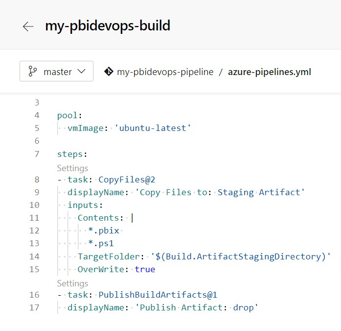
3. Save and run the build pipeline.
   
#### 5.2 Create a Release Pipeline
We create the release pipeline that utizilies our powershell script to deploy to the published reports to the Power BI portal.

1. Create a new *Release* pipeline, e.g. `my-pbidevops-release`.
2. Add an artifact and choose the newly created build pipeline source. 
   
3. Add a new Stage with an *Empty Job* and provide a name, e.g. `Deploy PBI Report`.
4. Click on the "+" (*Add a task to the Agent Job*), search and add a *Powershell Task*.    
5. Name the task, e.g. `Install PS Modules` and copy and paste the content below as an *Inline* script.  This will install the Powershell cmdlets used by the deployment Powershell scripts.
    ```
    Install-Module -Name MicrosoftPowerBIMgmt.Profile -Verbose -Scope CurrentUser -Force
    Install-Module -Name MicrosoftPowerBIMgmt.Workspaces -Verbose -Scope CurrentUser -Force
    ```
    

6.  Click on the "+" (*Add a task to the Agent Job*) again and add another *Powershell Task*.
8.  Name the task, e.g. `Run PS deploy script`, select a *File Path* type, click the elipses *...* and select either the *deploy-pbixreport-with-gateway.ps1* or *deploy-pbixreport.ps1* file.  Note: Path is visible only if the build pipeline from section 3 ran successfully.
    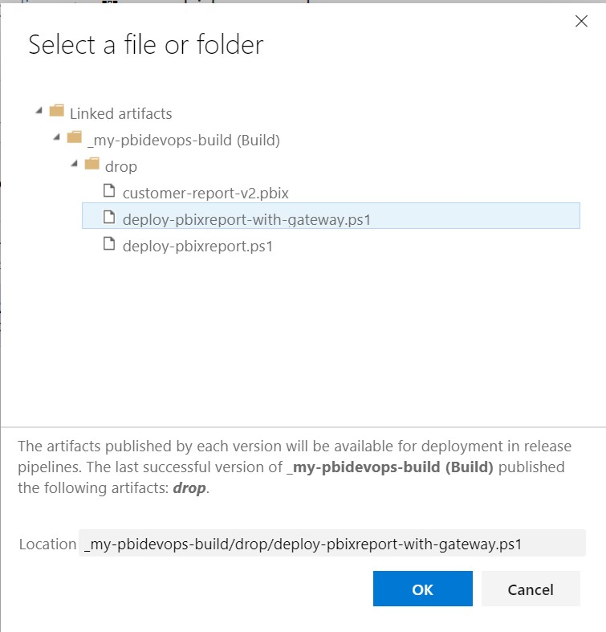

    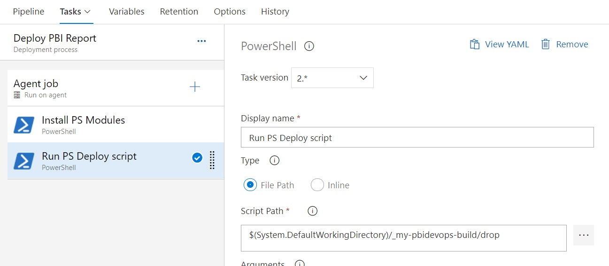
9.   Save the Release.

#### 5.3 Define the Variables
*We're on the home stretch!*  Here, we set up the variables referenced by the script using the *Pipeline Variables* and *Variable Groups*.  Pipeline variables are available to a particular pipeline and can be scoped with *Release* so they are accessible to the entire pipeline or scoped to a particular *Stage* within the pipeline.  Variable Groups are available across multiple pipelines and similarily can scoped to a Release or a Stage.  To keep our variables nice and tidy, we define our global variables as *Pipeline Variables* and environment specific (eg. Production, Dev, QA) variables as a *Variable Group* and tie it to a Stage.

**Pipeline Variables**
1.  Click the *Variables* link in the pipeline.
2.  Make sure *Pipeline variables* is selected on the left nav and add the following variables:
    
  | Variable Name | Value | Type | Scope |
  | ------------- | ----- | ---- | ----- |
  | tenant_id | [ Tenant Id of the registered AAD app ] | Plain text | Release |
  | client_id | [ Client Id of the registered AAD app ] | Plain text | Release |
  | client_secret | [ Client secret of the registered AAD app ] | Secret | Release |
  | pbixFilePath | [ File path to the published .pbix file] | Plain text | Release |
  | userAdminEmail | [ Email addresss of the PowerBI Pro user account] | Plain text | Release |
  | userAdminPassword | [ Password of the PowerBI Pro user account] | Secret | Release |
  | dbServerParamName | [ PowerBI report parameter name of the database server] | Plain text | Release |
  | dbNameParamName | [ PowerBI report parameter name of the database name] | Plain text | Release |
  | dbUserName* | [Database service account user name] | Plain text | Release |
  | dbUserPassword* | [Database service account password] | Secret | Release |

- *The dbUserName and dbUserPassword variables are required only if using the [deploy-pbixreport.ps1](./ps-scripts/deploy-pbixreport.ps1) script.
- To set up a variable as a Secret type, click the lock icon located to the right of the varable text field.

**Variable Groups**
16. Click on the *Variable groups* in the left nav and click *Manage variable groups*.
17. Click on *+ Variable group*, name the group, e.g. `my-variable-group` 
18. Add the following variables:
| Variable Name | Value |
| ------------- | ----- |
| workspacename | [ workspace name ] |
| dbServerParmName | [ database server name ] |
| dbNameParamName | [ database name ] |
| gatewayName | [ gateway name ] |
| gatewayDatasource | [ gateway datasource name ]| 
| scheduleJson | [json string of the dataset refresh schedule] <br>Example: `{ "value": {"enabled":"true","notifyOption":"NoNotification", "days": ["Sunday", "Tuesday","Thursday", "Saturday"], "times": ["07:00", "11:30", "16:00", "23:30"],"localTimeZoneId": "UTC" } } ` |

  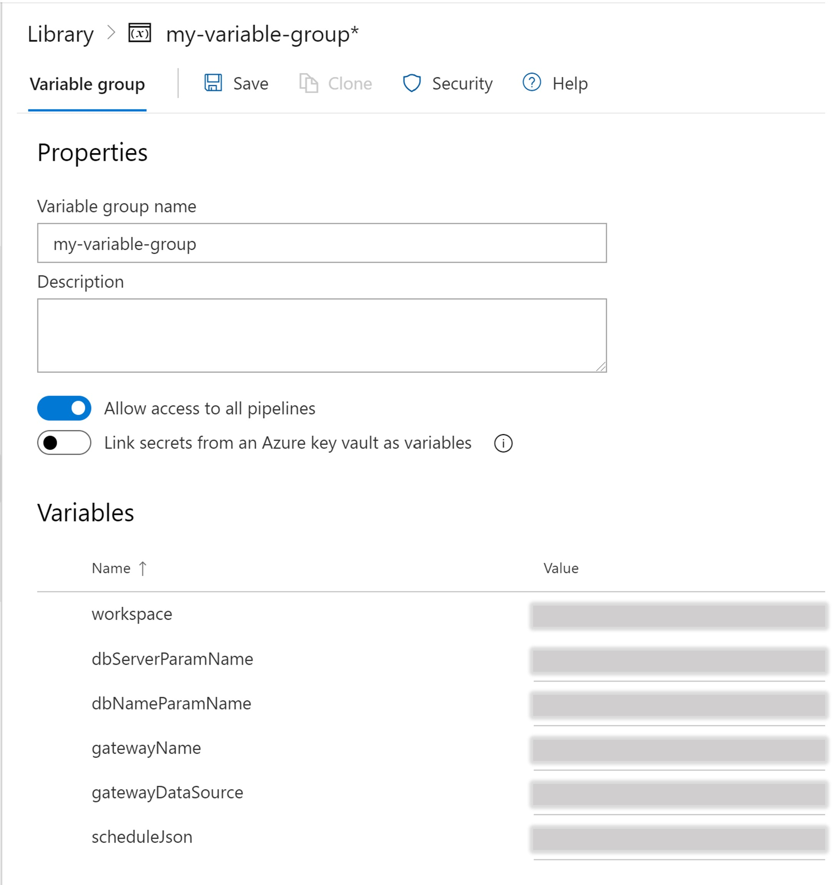

18. Save the group and go back to the Release, edit it, select *Variables*, *Variable groups*, and select *Link variable group* and link the variable group to the stage.
  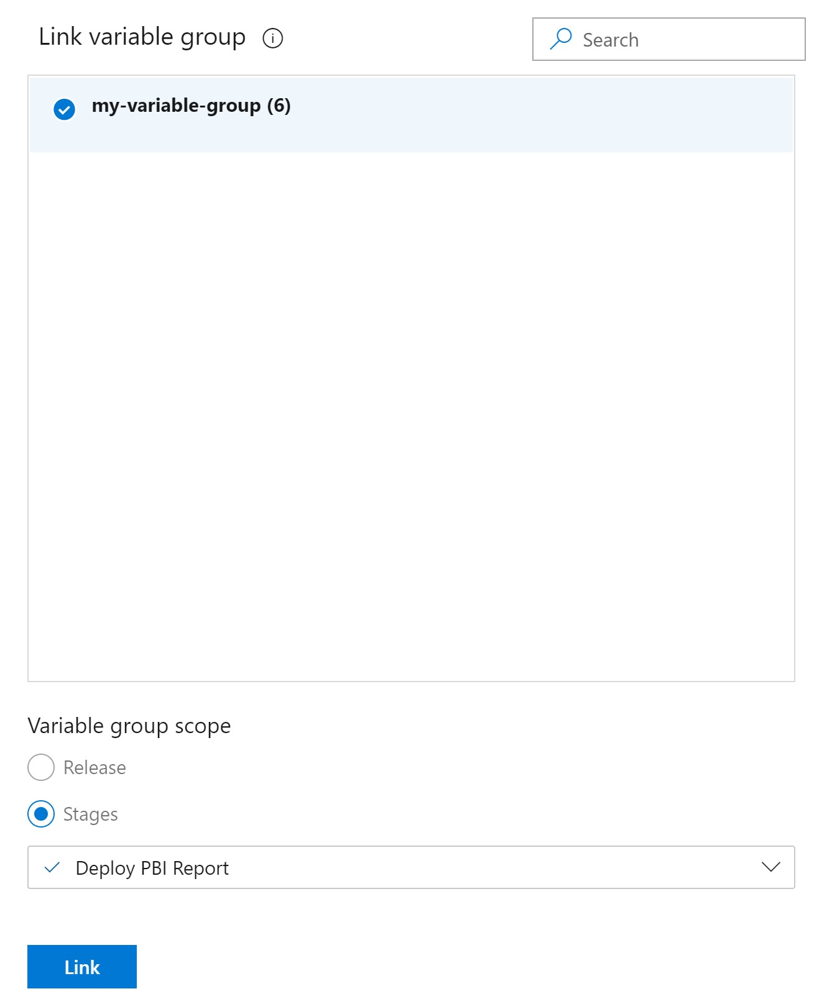
19. Save the Release.
        
### 6.0 Running it end to end
1. Run the Build pipeline.
2. Run the Release pipeline. 
3. Sign into your [Power BI portal](https://powerbi.microsoft.com/en-us/landing/signin/) using the admin user account and confirm your new named is workspace is present, the report is deployed and its dataset with all its settings (gateway connection, data source credentials, database parameters, scheduled refresh) are as expected.  
**Important reminder!** Recall this workspace and all its artifacts was provisioned by the service principal so in order to check the dataset's settings, the page will prompt you to "Take Over" the dataset with the admin user account that you signed in with.  In doing so, you will need to re-bind the gateway (if using one) datasource.  Once rebinded, you will be able to check the rest of the dataset's settings.

    **[TODO: Add updated screen shots here]**

### 6.0 Applying this to the Real Scenarios
**@TODO**

### 7.0 Final Thoughts
**@TODO**


