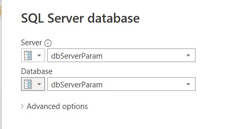

# Automating your Power BI Report deployments with Azure DevOps and Powershell   

This is a follow-up article to the [Deploying Power BI reports using Azure Devops](https://github.com/becheng/pbi-azuredevops-poc) sample.  In the previous sample, I showed how to develop an Azure Devops pipeline to automate the deployment of a Power BI report using the convenient [Power BI Actions](https://marketplace.visualstudio.com/items?itemName=maikvandergaag.maikvandergaag-power-bi-actionshttps://marketplace.visualstudio.com/items?itemName=maikvandergaag.maikvandergaag-power-bi-actions) add-in. This time we do everything with Powershell to unlock  several new capabilities.

## In this sample
- A **service principal** is used instead of a user account to deploy the PowerBI report.  
- An **on-premise PowerBI gateway** is used to connect to an on-prem data source and is accounted for in the pipeline.  *Alternative*: a different Powershell script is provided within this repo when the report is connecting to a cloud-only data source.  
- The report's **refresh schedule is automated**.  
- A **user account is automatically added to the workspace** to this user access.  Also at the time of writing this, the gateway binding using a service principal was not supported so the deploy script switches to user account for the management of the gateway portion.  
           
### 1.0 Create a Serivce Principal
1. Follow this [msdoc](https://docs.microsoft.com/en-us/power-bi/developer/embedded/embed-service-principal#get-started-with-a-service-principal) to create a service principal with access to the PowerBI REST APIs and the ability to create workspaces.  Skip steps 4 and 5 because it will be done by the script.
2. Make note of the tenantId, clientId and the clientSecret because they will be used in subsequent steps. 

### 2.0 Create the Report Database
1. Create a *Customer* database using the provided db script, [createDevCustomerTblWithData.sql](./db-scripts/createDevCustomerTblWithData.sql) either on a local/on-prem SQL Database Server (e.g. SQLExpress) if using a PowerBI gateway or on a Azure SQL DB if using a cloud-only data source. 

### 3.0 Install the Power BI Gateway
**Skip this section, if running this sample with an Azure Sql DB.**

Powershell is used to provision the gateway, however at the time of this writing, the feature is under preview so if your preference is to use a user account, follow this [msdoc](https://docs.microsoft.com/en-us/data-integration/gateway/service-gateway-install) instead.

1. Download the [gateway.ps1](./ps-scripts/gateway.ps1) script to the local machine where your on-premise data source resides. 
2. Update the variables within the script including the values you captured for your service principal.  
3. Run the script, e.g. `./gateway.ps1` and check your Task Manager to confirm the gateway is running.
    
4. Sign in to your [Power BI portal](https://powerbi.microsoft.com/) with your user account.  Go to Managed Gateways (*Settings* > *Manage Gateways*) and verify your named gateway is listed in *Gateway Clusters*.
    
5. Select the gateway and click *Add Data Source* (located at the top).
6. Name the data source, e.g. `my-gateway-datasource` and specify the connection values to the local data source.
      
7. Make note of your gateway name as it will be used later.
   
### 4.0 Parameterize the PowerBI Report data source
**Skip this section, if using the supplied report [customer-report-v3.pbix](./pbix/customer-report-v3.pbix).**

1. Using your [Power BI Desktop](https://powerbi.microsoft.com/en-us/desktop/) editor, create a new report, select *Transform data* and select *Data source settings*.
    
2. Select the *Change Source...* button to open the report's data source (in our case, it was Sql Server) window.
3. Select the *Server* dropdown and select *New Parameter...*  
   
4. In the *Manage Parameters* window: 
   - Add new parameter for the database server, e.g. `dbServerParam`.
   - Check the Required checkbox to make the parameter mandatory.
   - Enter your default server (typically your development instance) in the *Current Value* field.     
   
5. Repeat the above step and add new parameter for the database name, e.g. `dbNameParam`.  
6. Make note of both parameter names as they will be used later.
7. Apply the changes to the report, connect to the data source and build a sample report using the Customer table.
8. Save the pbix file and ensure the data source is saved with both parameters in place. 
   

### 5.0 Putting it all together in Azure DevOps
1. Sign into your [Azure Devops](https://dev.azure.com) instance and create a new project, e.g. `my-pbidevops-pipeline`.
2. Add your .pbix files to the project's repo.
3. Download a copy of the [deploy-report-with-gateway.ps1](./ps-scripts/deploy-pbixreport-with-gateway.ps1) or [deploy-pbixreport.ps1](./ps-scripts/deploy-pbixreport.ps1) (if using cloud data sources) and upload it to your project's repo.
   

#### 5.1 Create a Pipeline
1. Create a new *Pipeline*, e.g. `my-pbidevops-build`.
2. Copy the following yaml script and save it to the pipeline.  This script publishes the .pbix and .ps1 files so the (deployment) *Release* pipeline has access to them.
      
   ```
    trigger:
    - master

    pool:
      vmImage: 'ubuntu-latest'

    steps:
    - task: CopyFiles@2
      displayName: 'Copy Files to: Staging Artifact'
      inputs:
        Contents: |
          **/*.pbix 
          **/*.ps1
        TargetFolder: '$(Build.ArtifactStagingDirectory)'
        OverWrite: true
    - task: PublishBuildArtifacts@1
      displayName: 'Publish Artifact: drop'

   ```
   
3. Save and run the build pipeline.
   
#### 5.2 Create a Release Pipeline
1. Create a new *Release* pipeline, e.g. `my-pbidevops-release`.
2. Add an artifact and choose the newly created build pipeline source.
  
3. Add a new Stage with an *Empty Job* and provide a name, e.g. `Deploy PBI Report`.
4. Click on the "+" (*Add a task to the Agent Job*), search and add a *Powershell Task*.    
5. Name the task, e.g. `Install PS Modules` and copy and paste the content below as an *Inline* script.  This will install the Powershell cmdlets used by the deployment Powershell scripts. 
  
    ```
    Install-Module -Name MicrosoftPowerBIMgmt.Profile -Verbose -Scope CurrentUser -Force
    Install-Module -Name MicrosoftPowerBIMgmt.Workspaces -Verbose -Scope CurrentUser -Force
    Install-Module -Name MicrosoftPowerBIMgmt.Reports -Verbose -Scope CurrentUser -Force
    Install-Module -Name MicrosoftPowerBIMgmt.Data -Verbose -Scope CurrentUser -Force
    ```
   
   

6. Click on the "+" (*Add a task to the Agent Job*) again and add another *Powershell Task*.
7. Name the task, e.g. `Run PS deploy script`, select a *File Path* type, click the elipses *...* and select either the *deploy-pbixreport-with-gateway.ps1* or *deploy-pbixreport.ps1* file.  Note: Path is visible only if the build pipeline from section 3 ran successfully.
   
   <br>
   
8. Save the Release.

#### 5.3 Define the variables
**Pipeline Variables**
1. Click the *Variables* link in the pipeline.
2. Make sure *Pipeline variables* is selected on the left nav and add the following variables:
   | Variable Name | Value | Type | Scope |
   | ------------- | ----- | ---- | ----- |
   | tenantId | [ Tenant Id of the registered AAD app ] | Plain text | Release |
   | clientId | [ Client Id of the registered AAD app ] | Plain text | Release |
   | clientSecret | [ Client secret of the registered AAD app ] | Secret | Release |
   | userAdmin | [ Admin PowerBI Pro user account, e.g. user@contoso.onmicrosoft.com] | Plain text | Release |
   | userAdminPassword | [ Password of the PowerBI Pro user account] | Secret | Release |   
   | dbServerParamName | [ Name of parameter for the pbi report's db server ] | Secret | Release |
   | dbNameParamName | [ Name of parameter for the pbi report's db name ] | Secret | Release |
   
**Variable Groups**
1. Click on the *Variable groups* in the left nav and click *Manage variable groups*.
2. Click on *+ Variable group*, name the group, e.g. `my-variable-group` 
3. Add the following variables:
   | Variable Name | Value | Type |
   | ------------- | ----- | ---- |
   | workspacename | [ workspace name ] | Plain text |
   | pbixFilePath | [ File path to the published .pbix file] | Plain text |
   | reportName | [ Name of the Power BI Report ] | Plain text |
   | gatewayName | [ gateway name ] | Plain text |
   | scheduleJson | [ json string of the dataset refresh schedule ] | Plain text |
   | dbUserName* | [ Database service account user name ] | Secret |
   | dbUserPassword* | [ Database service account password ] | Secret |
   | dbServerParamValue | [ database server name ] | Plain text | Release | Plain text |
   | dbNameParamValue | [ database name ] | Plain text | Release | Plain text |
   
   \* The dbUserName and dbUserPassword variables are required only if using the [deploy-pbixreport.ps1](./ps-scripts/deploy-pbixreport.ps1) script.
   
   Notes:
   - The pbixFilePath is the path to the published .pbix file with a format: `$(System.DefaultWorkingDirectory)/_[YOUR BUILD PIPELINE NAME]/drop/[YOUR PBIX PATH]/[YOUR REPORT NAME].pbix`.  Example:   
     ```
     $(System.DefaultWorkingDirectory)/_my-pbidevops-build/drop/pbix/customer-report-v2.pbix
     ``` 
   - Example of scheduleJson value: 
      ```
      { 
        "value": {
          "enabled":"true",
          "notifyOption":"NoNotification", 
          "days": ["Sunday", "Tuesday","Thursday", "Saturday"], 
          "times": ["07:00", "11:30", "16:00", "23:30"],
          "localTimeZoneId": "UTC" 
        } 
      } 
      ```
4. Save the group and go back to the Release, edit it, select *Variables*, *Variable groups*, and select *Link variable group* and link the variable group to the stage.
   
   
5. Click *Link* to the save linkage.

**Resolving Secret Variables**

Variables marked as secret in either in *Variable Groups* or *Pipeline Variables* require extra set up so our PowerShell script can decrypt the variables to use them.  
1. Click *Tasks* in your pipeline, click on the *Run PS deploy script* and select its *Environment Variables* section.
2. Enter the following to decrypt all our secret variables:
   | Name | Value |
   | ------------- | ----- |
   | clientSecret | $(clientSecret) |
   | userAdminPassword | $(userAdminPassword) |
   | dbUserName* | $(dbUserName) | 
   | dbUserPassword* | $(dbUserPassword) |  
   
   \* only applicable if using a cloud datasource
3. Save the Release.
    
### 6.0 Running it end to end
1. Run the Build pipeline.
2. Run the Release pipeline. 
3. Sign into your [Power BI portal](https://powerbi.microsoft.com/en-us/landing/signin/) using the admin user account and confirm your new workspace is deployed with the report and its dataset is configured correctly (e.g. gateway connection, data source credentials, database parameters, scheduled refresh).
    
    
    **Important:** 
    \* Recall this workspace and all its artifacts was provisioned by the service principal so in order to check the dataset's settings, the page will prompt you to "Take Over" the dataset with the admin user account that you signed in with.  In doing so, you will need to re-bind the gateway data source.  Once rebinded, you will be able to check the rest of the dataset's settings.
    \** If running for the first time, the deployment may fail because the IP of the PowerBI workspace has not been whitelisted on the target database's firewall.  To fix, take over with an admin account on the power bi service portal and manually change the db credentials, run a refresh on the dataset which will result in an error where the IP is shown.  Whitelist the IP on your database server and run refresh manually on the pbi portal to confirm the connection.      

### 7.0 Applying to real world scenarios
So now that you got this sample working, *what now?, how do I apply to this to a real world scenario?*  The good news, you can take all learnings here and tweak it to align to your real world scenarios.  We won’t get into the details here, but by using a combination of different *Stages* and environment-specific *Variable Groups* in a *Release* pipeline, you have the ability to deploy different reports to different report environments (workspaces).

Below is an example of a pipeline that deploys a Tradewinds report and Contoso report each to their respected environments.


### 8.0 Final Thoughts
There isn't much you *can't* do with [MicrosoftPowerBIMgmt Powershell cmdlets](https://docs.microsoft.com/en-us/powershell/power-bi/overview?view=powerbi-ps) and [Power BI Rest APIs](https://docs.microsoft.com/en-us/rest/api/power-bi/) to have a fully functional CI/CD pipeline to manage the lifecycle of your Power BI reports.  Those looking to do more than what a Power BI Azure Devops add-in can offer (see our [first sample](https://github.com/becheng/pbi-azuredevops-poc)) or have a more complex reporting environment with gateways, this recipe of using Powershell and Azure Devops is a viable option.  To close off the series, we are planning to recreate this sample using the [Github Actions](https://github.com/features/actions) as our third and last article. 