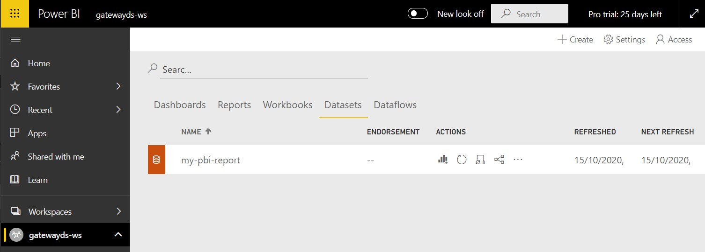
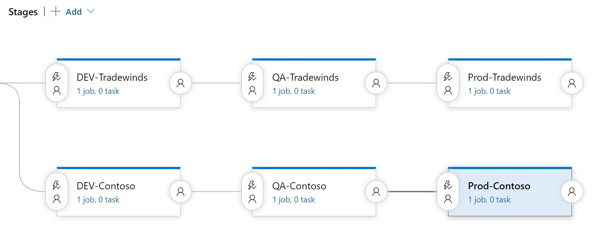

# Powering up your Power BI Report deployments with Azure DevOps and Powershell!   

This article is the follow-up to our [Deploying Power BI reports using Azure Devops](https://github.com/becheng/pbi-azuredevops-poc) sample.  That sample showed how to develop a pipeline to automate the deployment of a Power BI report using [Azure Devops](https://dev.azure.com/) with the easy to use [Power BI Actions](https://marketplace.visualstudio.com/items?itemName=maikvandergaag.maikvandergaag-power-bi-actionshttps://marketplace.visualstudio.com/items?itemName=maikvandergaag.maikvandergaag-power-bi-actions) add-in.  This time around, we take it up a notch and do everything with Powershell to address several areas where the first sample fell short to really *power up* the Power BI report deployments.

## This time around...
- **Use of a service principal** instead of a user account to mange the lifecycle of the Power BI reports.  Using a service principal is best practice and does not incur the overhead of using an account with a Power BI pro license.
- **Use of a on-premise gateway**.  Not all reporting data sources are built the same and so you may find yourself in need of gateway to connect your reports to on-premise data sources.  This sample demonstrates how to provision a gateway using a Powershell script using a service principal and automate the binding of a report's dataset to that gateway as part of your pipeline run.  For those fortunate enough to use cloud data sources, we got you covered and provide an alterative Powershell script to use.  
- **Automating the dataset's refresh schedule** as part of the pipeline, *because why wouldn't you?* 
- **Adding a user account (with a Power BI pro account) to the workspace**.  *But didn't you just say we should be using a service principal?*, you ask.  Well yes, we did, and it is still the  preferred practice, but at the time of writing this, the gateway binding is limited to using a user account, so we will need that user account to perform that particular task within our script.  That being said, you cannot sign into your Power BI portal using a service principal, so adding a user account to the workspace comes in handy to eyeball changes of your deployments.  
           
### 1.0 Creating the serivce principal
We start things off by creating the service principal to manage our reports and the environments. To create the service principal, we i) register an app with a secret in Azure AD, ii) assign it with Power BI API permissions, iii) create a new security group and add the app as a as a member, and lastly iv) allow that group with access to PowerBI APIs and the ability to create new workspaces in the Power BI portal. 

1. Follow this [msdoc](https://docs.microsoft.com/en-us/power-bi/developer/embedded/embed-service-principal#get-started-with-a-service-principal) to set up the service principal with access to the PowerBI APIs.  **Important**: Skip steps 4 & 5 because we do these dynamically via the script. 
2. In your [Azure portal](https://https://portal.azure.com/), select your Azure active directory app, go to its *API permissions*, click *Add a permission*, select *Power BI Service* and add the *Delegated* permissions of `Dataset.ReadWrite.All` and `Workspace.ReadWrite.All`.
    
3. Sign in to your [Power BI portal](https://powerbi.microsoft.com/) with an admin account, go to *Settings* (Gear Icon), *Admin Portal*, *Tenant settings*.
4. Under *Developer settings*, go to *Allow service principals to use Power BI APIs*, enable it and add the security group and click the *Apply* button.

      
5. Under *Workspace settings*, go to *Create workspaces*, enable it and add the security group and click the *Apply* button.

   

### 2.0 Installing the Power BI Gateway
We use a *nifty* Powershell script to provision the gateway under a service principal account.  Again, this feature is under preview at the time of this writing so if you prefer to use a user account, follow this [msdoc](https://docs.microsoft.com/en-us/data-integration/gateway/service-gateway-install) instead.

1. Download the [gateway.ps1](./ps-scripts/gateway.ps1) script to the local machine where your on-premise data source resides. 
2. Update the script variables including the app client Id, tenant Id, secret and the email of user account with Power BI pro license.  
3. Run the script, e.g. `./gateway.ps1` and check your Task Manager to confirm the gateway is running.

    
4. Sign in to your [Power BI portal](https://powerbi.microsoft.com/) with your user account, go to *Settings*, *Manage Gateways* and confirm your named gateway is listed under *Gateway Clusters*.

    
5. Select the gateway and click *Add Data Source* (located at the top).
6. Name the data source, e.g. `my-gateway-datasource` and specify the connection values to the local data source.  In our case, we used a local Sql Server instance, enabled **SQL authentication**, and connected with a service level database username and password.

      
7. Take note of your gateway name because it will be used later to setup your devops pipeline.

### 3.0 Parameterizing the PowerBI Report datasource
For context, our deployment Powershell scripts depends on the best practice of using parameterized data sources. If your reports already do this, *Awesome!*, just move on to the next section.

1. Open your report using your [Power BI Desktop](https://powerbi.microsoft.com/en-us/desktop/) editor, expand *Transform data* and select *Data source settings*.
    
2. Select the *Change Source...* button to open the report's data source (in our case, it was Sql Server) window.
3. Select the *Server* dropdown and select *New Parameter...*  
   
4. In the *Manage Parameters* window: 
   - Add new parameter for the database server, e.g. `dbServerParam`.
   - Check the Required checkbox to make the parameter mandatory.
   - Enter your default server (typically your development instance) in the *Current Value* field.     
   
5. Repeat the above step and add new parameter for the database name, e.g. `dbNameParam`.
6. Make note of both parameter names because they will be used later to set up the pipeline.

### 4.0 A break down of the Powershell script
Before we get into creating the devops pipelines, let's break down our deployment scripts and explain what they'll doing.  Where possible we leverage the *[MicrosoftPowerBIMgmt](https://docs.microsoft.com/en-us/powershell/power-bi/overview?view=powerbi-ps)* Powershell cmdlets, because *why reinvent the wheel?* otherwise we use the *Invoke-PowerBIRestMethod* cmdlet (also part of *MicrosoftPowerBIMgmt* module) to invoke any of the Power BI Rest APIs where functionality is not covered by the cmdlets.  The nice thing about using these cmdlets is the authorization access token is taken care for you for your entire session once you've signed in using the *Connect-PowerBIServiceAccount* cmdlet.

**[deploy-pbixreport.ps1](./ps-scripts/deploy-pbixreport.ps1) script (for cloud only data sources)**
1. Sign in using the service principal.
2. Retrieve the target workspace and create it if it does not exist.
3. Add the admin user to the workspace if user does not already exist.
4. Upload the report and overwrite the older version (if one exists).
5. Take over the report's dataset using the service principal.
6. Update the dataset's data source's parameters.
7. Update the dataset's data source's credentials.
8. Update/Set the scheduled refresh of the dataset.
9. Invoke a dataset refresh.  

**[deploy-report-with-gateway.ps1](./ps-scripts/deploy-pbixreport-with-gateway.ps1) script (for on-premise data sources)**

Step 1-6 are identical to the above.

7. Sign in using the admin user account.
8. Take over the report's dataset using the admin user account.
9. Look up the target gateway and bind it to the dataset.
10. Update/Set the scheduled refresh of the dataset.
11. Invoke a dataset refresh.
12. Take (back) the report's dataset using the service principal.    


### 5.0 Putting it all together in Azure DevOps
We use [Azure Devops](https://dev.azure.com/) to build our devops pipelines.

1. Sign into your [Azure Devops](https://dev.azure.com) instance and create a new project, e.g. `my-pbidevops-pipeline`.
2. Add your .pbix files to the project's repo.
3. Download a copy of the [deploy-report-with-gateway.ps1](./ps-scripts/deploy-pbixreport-with-gateway.ps1) or [deploy-pbixreport.ps1](./ps-scripts/deploy-pbixreport.ps1) (if using cloud data sources) and upload it to your project's repo.

   

#### 5.1 Create a Pipeline
We construct a simple build pipeline that publishes our files for deployment.

1. Create a new *Pipeline*, e.g. `my-pbidevops-build`.
2. Copy the following yaml script and save it to the pipeline.  This script publishes the .pbix and .ps1 files so the (deployment) *Release* pipeline has access to them.
      
   ```
    trigger:
    - master

    pool:
      vmImage: 'ubuntu-latest'

    steps:
    - task: CopyFiles@2
      displayName: 'Copy Files to: Staging Artifact'
      inputs:
        Contents: |
          *.pbix 
          *.ps1
        TargetFolder: '$(Build.ArtifactStagingDirectory)'
        OverWrite: true
    - task: PublishBuildArtifacts@1
      displayName: 'Publish Artifact: drop'

   ```
   
   

3. Save and run the build pipeline.
   
#### 5.2 Create a Release Pipeline
We create the release pipeline that uses our Powershell script to deploy the published reports to the Power BI portal.

1. Create a new *Release* pipeline, e.g. `my-pbidevops-release`.
2. Add an artifact and choose the newly created build pipeline source.

  

3. Add a new Stage with an *Empty Job* and provide a name, e.g. `Deploy PBI Report`.

4. Click on the "+" (*Add a task to the Agent Job*), search and add a *Powershell Task*.    
5. Name the task, e.g. `Install PS Modules` and copy and paste the content below as an *Inline* script.  This will install the Powershell cmdlets used by the deployment Powershell scripts. 
  
    ```
    Install-Module -Name MicrosoftPowerBIMgmt.Profile -Verbose -Scope CurrentUser -Force
    Install-Module -Name MicrosoftPowerBIMgmt.Workspaces -Verbose -Scope CurrentUser -Force
    Install-Module -Name MicrosoftPowerBIMgmt.Reports -Verbose -Scope CurrentUser -Force
    Install-Module -Name MicrosoftPowerBIMgmt.Data -Verbose -Scope CurrentUser -Force
    ```
   
   

6. Click on the "+" (*Add a task to the Agent Job*) again and add another *Powershell Task*.
7. Name the task, e.g. `Run PS deploy script`, select a *File Path* type, click the elipses *...* and select either the *deploy-pbixreport-with-gateway.ps1* or *deploy-pbixreport.ps1* file.  Note: Path is visible only if the build pipeline from section 3 ran successfully.
   
   


   

8. Save the Release.

#### 5.3 Define the variables
*We're on the home stretch!*  Here, we set up the variables referenced by the script using the *Pipeline Variables* and *Variable Groups*.  Pipeline variables are available to a particular pipeline and can be scoped with *Release* so they are accessible to the entire pipeline or scoped to a particular *Stage* within the pipeline.  Variable Groups are available across multiple pipelines and similarly can scoped to a Release or a Stage.  To keep our variables nice and tidy, we define our global variables as *Pipeline Variables* and environment specific (e.g. Production, Dev, QA) variables as a *Variable Group* and tie it to a Stage.

**Pipeline Variables**
1. Click the *Variables* link in the pipeline.
2. Make sure *Pipeline variables* is selected on the left nav and add the following variables:
   | Variable Name | Value | Type | Scope |
   | ------------- | ----- | ---- | ----- |
   | tenantId | [ Tenant Id of the registered AAD app ] | Plain text | Release |
   | clientId | [ Client Id of the registered AAD app ] | Plain text | Release |
   | clientSecret | [ Client secret of the registered AAD app ] | Secret | Release |
   | userAdminEmail | [ Email addresss of the PowerBI Pro user account] | Plain text | Release |
   | userAdminPassword | [ Password of the PowerBI Pro user account] | Secret | Release |
   | dbServerParamValue | [ database server name ] | Plain text | Release |
   | dbNameParamValue | [ database name ] | Plain text | Release |
   
- To set up a variable as a Secret type, click the lock icon located to the right of the variable text field.
- The pbixFilePath is the path to the published .pbix file with a format: `$(System.DefaultWorkingDirectory)/_[YOUR BUILD PIPELINE NAME]/drop/[YOUR REPORT NAME].pbix`.  
Example: $(System.DefaultWorkingDirectory)/_**my-pbidevops-build**/drop/**my-powerbi-report**.pbix` 

**Variable Groups**
1. Click on the *Variable groups* in the left nav and click *Manage variable groups*.
2. Click on *+ Variable group*, name the group, e.g. `my-variable-group` 
3. Add the following variables:
   | Variable Name | Value |
   | ------------- | ----- |
   | workspacename | [ workspace name ] |
   | pbixFilePath | [ File path to the published .pbix file] |
   | gatewayName | [ gateway name ] |
   | scheduleJson | [ json string of the dataset refresh schedule ] |
   | dbUserName* | [ Database service account user name ] | 
   | dbUserPassword* | [ Database service account password ] | 
  
   - *The dbUserName and dbUserPassword variables are required only if using the [deploy-pbixreport.ps1](./ps-scripts/deploy-pbixreport.ps1) script.
   - Example of scheduleJson value: 
      ```
      { 
        "value": {
          "enabled":"true",
          "notifyOption":"NoNotification", 
          "days": ["Sunday", "Tuesday","Thursday", "Saturday"], 
          "times": ["07:00", "11:30", "16:00", "23:30"],
          "localTimeZoneId": "UTC" 
        } 
      } 
      ```
4. Save the group and go back to the Release, edit it, select *Variables*, *Variable groups*, and select *Link variable group* and link the variable group to the stage.
   
   
5. Click *Link* to the save linkage.

**Resolving Secret Variables**

Variables marked as secret in either in *Variable Groups* or *Pipeline Variables* require extra set up so our PowerShell script can decrypt the variables to use them.  
1. Click *Tasks* in your pipeline, click on the *Run PS deploy script* and select its *Environment Variables* section.
2. Enter the following to decrypt all our secret variables:
   | Name | Value |
   | ------------- | ----- |
   | clientSecret | $(clientSecret) |
   | userAdminPassword | $(userAdminPassword) |
   | dbUserName* | $(dbUserName) | 
   | dbUserPassword* | $(dbUserPassword) |  
   *only applicable if using a cloud datasource
3. Save the Release.
    
### 6.0 Running it end to end
1. Run the Build pipeline.
2. Run the Release pipeline. 
3. Sign into your [Power BI portal](https://powerbi.microsoft.com/en-us/landing/signin/) using the admin user account and confirm your new workspace is deployed with the report and its dataset is configured correctly (e.g. gateway connection, data source credentials, database parameters, scheduled refresh).
     
    
    
    **Important:** recall this workspace and all its artifacts was provisioned by the service principal so in order to check the dataset's settings, the page will prompt you to "Take Over" the dataset with the admin user account that you signed in with.  In doing so, you will need to re-bind the gateway data source.  Once rebinded, you will be able to check the rest of the dataset's settings.  

### 7.0 Applying to real world scenarios
So now that you got this sample working, *what now?, how do I apply to this to a real world scenario?*  The good news, you can take all learnings here and tweak it to align to your real world scenarios.  We won’t get into the details here, but by using a combination of different *Stages* and environment-specific *Variable Groups* in a *Release* pipeline, you have the ability to deploy different reports to different report environments (workspaces).

Below is an example of a pipeline that deploys a Tradewinds report and Contoso report each to their respected environments.



### 8.0 Final Thoughts
There isn't much you *can't* do with [MicrosoftPowerBIMgmt Powershell cmdlets](https://docs.microsoft.com/en-us/powershell/power-bi/overview?view=powerbi-ps) and [Power BI Rest APIs](https://docs.microsoft.com/en-us/rest/api/power-bi/) to have a fully functional CI/CD pipeline to manage the lifecycle of your Power BI reports.  Those looking to do more than what a Power BI Azure Devops add-in can offer (see our [first sample](https://github.com/becheng/pbi-azuredevops-poc)) or have a more complex reporting environment with gateways, this recipe of using Powershell and Azure Devops is a viable option.  To close off the series, we are planning to recreate this sample using the [Github Actions](https://github.com/features/actions) as our third and last article.          


